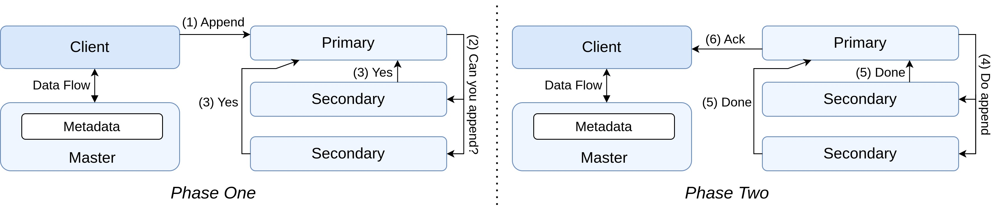

# Master

The entry point into chunk servers is the [`../cmd/chunkserver/main.go`](../cmd/chunkserver/main.go) script which expects a port using the `--port` argument and loads other configurations from the [`../configs/chunkserver-config.yml`](../configs/chunkserver-config.yml) file.

## Table of Contents

- [Proto Definitions](#proto-definitions)

## Proto Definitions

Communications between the client and the chunk servers are defined within `api/proto/chunk_operations/chunk_operations.proto`:

```proto
service ClientMasterService {
    rpc GetFileChunksInfo(GetFileChunksInfoRequest) returns (GetFileChunksInfoResponse) {}
    // Get the last file chunk related to a file
    rpc GetLastChunkIndexInFile(GetLastChunkIndexInFileRequest) returns (GetLastChunkIndexInFileResponse) {}
    rpc CreateFile(CreateFileRequest) returns (CreateFileResponse) {}
    rpc DeleteFile(DeleteFileRequest) returns (DeleteFileResponse) {}
    rpc RenameFile(RenameFileRequest) returns (RenameFileResponse) {}
}
```

Communications between chunk servers (primary and secondaries) are defined with the `api/proto/chunk/chunk.proto` file:

```proto
service ChunkService {
    rpc PushData (stream DataChunk) returns (PushDataResponse);
    rpc ForwardWriteChunk (ForwardWriteRequest) returns (ForwardWriteResponse);
    rpc ForwardAppendChunkPhaseOne (ForwardWriteRequest) returns (ForwardWriteResponse);
    rpc ForwardAppendChunkPhaseTwo (ForwardWriteRequest) returns (ForwardWriteResponse);
    rpc ForwardReplicateChunk (ForwardReplicateChunkRequest) returns (ForwardReplicateChunkResponse);
}
```

## Initialization

Loads information from the configuration file as mentioned above and creates a chunk server instance with related data (chunks and metadata) being stored in `config.DataDir/serverID`.

```go
type ChunkServer struct {
    mu sync.RWMutex
    // Server identification
    serverID string
    address  string
    config *Config
    dataDir   string
    serverDir string // Complete path including serverID
    chunks    map[string]*ChunkMetadata
    // Operation coordination
    operationQueue *OperationQueue
    leases         map[string]time.Time
    // Master connection
    masterClient  chunk_pb.ChunkMasterServiceClient
    heartbeatStop chan struct{}
    // Server state
    availableSpace int64
    isRunning      bool
    chunkPrimary map[string]bool
    pendingData     map[string]map[string]*PendingData // operationID -> chunkHandle -> data
    pendingDataLock sync.RWMutex
    grpcServer *grpc.Server
    chunk_ops.UnimplementedChunkOperationServiceServer
    chunkserver_pb.UnimplementedChunkServiceServer
}
```

Subsequently, recover metadata (if existing) using `RecoverMetadata` (defined in `internal/chunkserver/metadata.go`) and starts a Goroutine for checkpointing the metadata every 5 seconds. This recovery deletes entries for chunks whose data no longer exists on the chunk server's stable storage.

### Other documentation

The implementation is similar to that of the original GFS with certain caveats. Please refer to our technical report (TODO: add link) or the AI generated documentation ([Code Documentation](ai-generated-code-docs/chunk-server-code-documentation.md), [Workflow Documentation](ai-generated-code-docs/workflow-documentation-of-chunk-server-interations.md)).

### Diagram for Exactly-Once Appends

Exactly once appends are achieved using 2PC.


